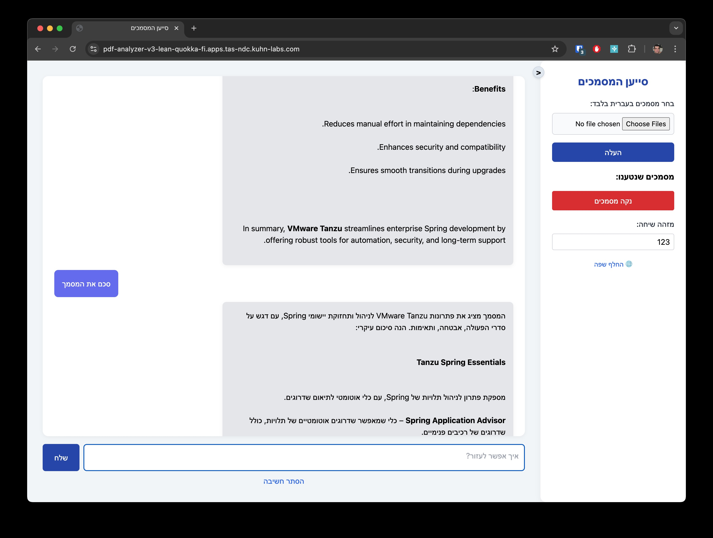

# Multilingual Document Analyzer for Tanzu Platform - Powered by Spring AI



This is a demo Spring Boot application that lets you upload a collection of PDF and Word documents and ask questions about it using your choice of an embedding model and an LLM.

## Features
- The app supports both English and Hebrew.
- If your PDF document(s) are in Hebrew, use the Hebrew UI while uploading. There's a "Change Language" toggle.
- If your PDF document(s) are in English, use the English UI while uploading.
- The reason for this is that processing Hebrew (or any right-to-left) documents is different than processing latin-based documents.
- Microsoft Word is agnostic to source languge so any would do.
- After processing is complete, you may ask your questions in either language. The response language is based on the current UI language, regardless of the document's original language. For example - the screenshot above first answered when the UI was in English, and then the same question was answered when the UI was in Hebrew. Hooray to the power of embeddings and RAG!
- The app uses pgVector to store embeddings. You may click "Clear PDFs" to remove all current embeddings from the database.
- The app sends a conversation ID so that Spring AI can manage a chat history on behalf of a user. Enter a unique conversion ID (such as a random number) to make sure your conversation history is not clashing with other users of the system.

### Running Locally

If you have Ollama installed you may run the app locally.

Run a local postgres container using:

```
docker run --name pgvector \
  -e POSTGRES_USER=myuser \
  -e POSTGRES_PASSWORD=mypassword \
  -e POSTGRES_DB=mydb \
  -p 5432:5432 \
  -d ankane/pgvector:latest
```

Then simply run `mvn spring-boot:run`. It may take a while for Spring AI to pull the models used by the app. You may change the embedding and chat models being used in `application.yaml`.

### Deploying to Tanzu Platform
Create 3 services in the Tanzu Platform (Cloud Foundry) marketplace:

- A GenAI service plan that supports embeddings, called `embed`.
- A GenAI service plan that supports chat, called `chat`.
- A Postgres service plan called `postgres`.

All that's left is to run:

```
./mvnw clean package && cf push
```

Pull requests are welcomed!

Oded S.
